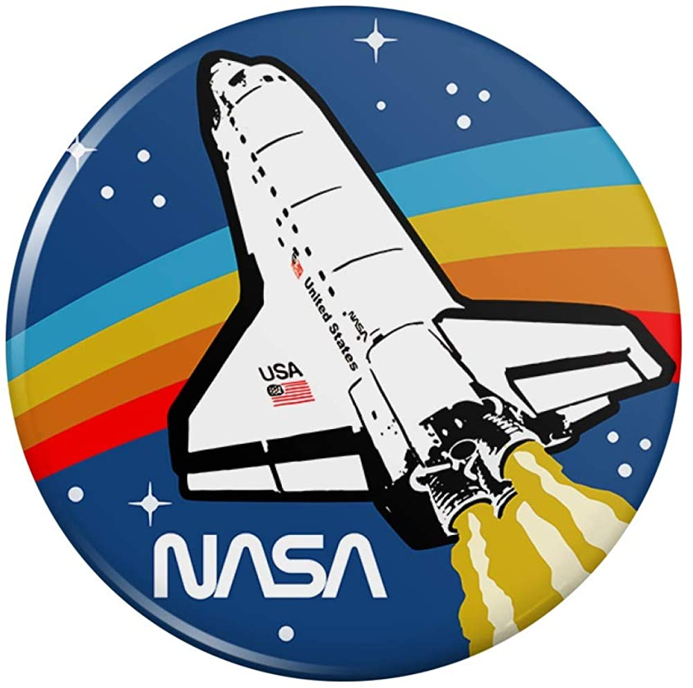

<h1 style = "text-align:center"> Exoplanets data interface  </h1> 

*An interface for the visualization of data using the NASA api*

<i><b> Author:</b><i> Bernat Ferrer</i>

<h3>Description</h3>

This project provides the user with an interface for a better interaction and visualization of scientific data . He or she can  interact with the plots and change  its settings accordingly . There is also a section for checking which is the astronomy picture of the day and an explanation from a professional astronomer.   

<h3>Folder structure</h3>

 This project contains: 

* index.html : Log in and register

* app.html: Data interface, accessed once the user is logged in.

* phpunit.xml: Configuration for the test classes stored in the tests folder

* composer.json/composer.lock: list of packages used in PHP

* package.json/package-lock.json: list of packages used in javascript

  

* **assets folder** :Project assets like logos, fonts or  json objects for rendering graphics

 

* **css folder**:  style sheets.

   	- styles.css :  Style sheet for the index document.
    - app.css:  Style sheet for the app document.

 

* **tests folder / unit folder**: Folder containing the test documents  .

  - csvTest:  test class for the csv tools .

  - projectStructureTest: test class for testing that the whole project structure remains the same.

  - usersTest: Test class for validating and checking the data from the users.

 

* **documentation folder**: folder containing the documentation.

  - documentation.pdf: documentation regarding the developing of the project
  
  - proposal.pdf: presentation of the initial proposal

  * **Postman folder** : folder containing some of  example api  of the requests performed.

    

- **server folder**:

  * api_requests.php: handles queries related with  fetching to the NASA api.
  
  * csvTools.php: Set of functions for a better handling of csv files.
  
  * sign.php: Handles the sign in , sign out and registering.
  
  * utils.php: Set of general functions used throughout the server.
  
  * viewmodel.php : Document recieving the queries from php that expect data in return.
  
  * **data folder** :  Folder containing the user folders.

  

* **src folder**

  * sign.js: Document handling the signing in or registering of the user. included in index.html

  * app.js: Document handling the user interaction in app.html, once the user is logged in

  * data.js: Document containing functions that fetch the server

  * customCharts.js: Document containing  a class that enables a better  custom configuration of  a given
  
    chart, created with the chartjs library.

  * validate.js: Set of functions used for validating  inputs.

    ​	

<h3>Users.json</h3>

<h3>NASA API(S)</h3>

  NASA offers a set of api's accessible with the same api key.

* **Obtaining an api key**.  In order to get an api key you just have to  give your first name, last name and a valid email .   .  Using this key, you will be able o use apis like *Astronomy picture of the day* ,  *Earth*,  *Exoplanet*, *Mars rover Photos*,  and many others.

  

-  **Limits**: Hourly Limit: 1,000 requests per hour.

  

- **check usage**: Your can check your current rate limit and usage details by inspecting the `X-RateLimit-Limit` and `X-RateLimit-Remaining`HTTP headers that are returned on every API response.

 

<h4>Exoplanet Archive</h4>

The Exoplanet Archive API allows programatic access to [NASA's Exoplanet Archive](https://exoplanetarchive.ipac.caltech.edu/index.html) database. This API contains a ton of options so to get started please visit [this page](https://exoplanetarchive.ipac.caltech.edu/docs/program_interfaces.html) for introductory materials. To see [what data](https://exoplanetarchive.ipac.caltech.edu/docs/data.html) is available in this API [visit here](https://exoplanetarchive.ipac.caltech.edu/docs/program_interfaces.html#data) and also be sure to check out [best-practices and troubleshooting](https://exoplanetarchive.ipac.caltech.edu/docs/program_interfaces.html#troubleshoot) in case you get stuck.

<h5>Example queries</h5>

* confirmed planets that transit their host stars : 

  `https://exoplanetarchive.ipac.caltech.edu/cgi-bin/nstedAPI/nph-nstedAPI?&table=exoplanets&format=ipac&where=pl_tranflag=1`

* All planetary candidates smaller than 2Re with equilibrium temperatures between 180-303K

    ` https://exoplanetarchive.ipac.caltech.edu/cgi-bin/nstedAPI/nph-nstedAPI?table=cumulative&where=koi_prad<2andkoi_teq>180 and    koi_teq<303andkoi_dispositionlike'CANDIDATE')  `

  

<h4>Astronomy picture</h4>

With this api you can fetch the data of a picture  from the  website https://apod.nasa.gov/apod/astropix.html and its description given a day between 2020 and 1995.

<h5>Query parameters</h5>

| Parameter | Type       | Default  | Description                                    |
| :-------- | :--------- | :------- | :--------------------------------------------- |
| date      | YYYY-MM-DD | *today*  | The date of the APOD image to retrieve         |
| hd        | bool       | False    | Retrieve the URL for the high resolution image |
| api_key   | string     | DEMO_KEY | api.nasa.gov key for expanded usage            |

 

<h5>Example query</h5>

`https://api.nasa.gov/planetary/apod?api_key=DEMO_KEY`

